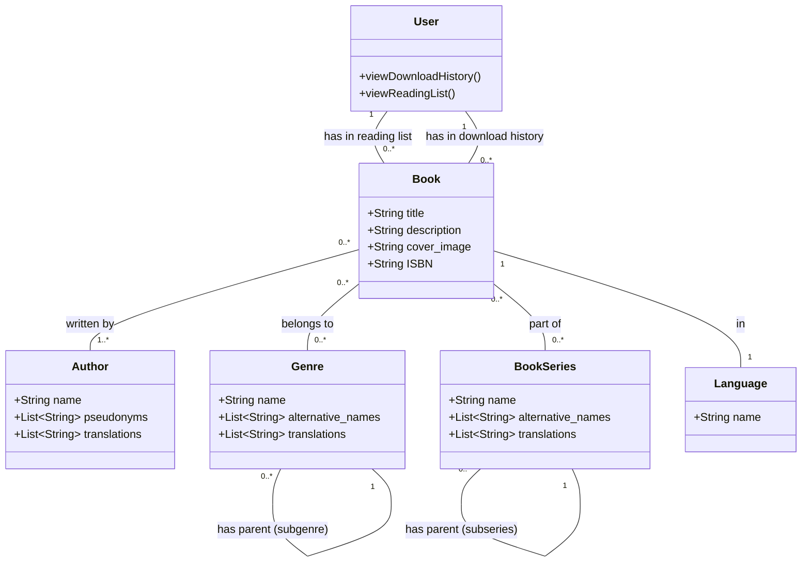

# Project: Bookshelf

## Project Overview

Bookshelf is a Django-based web application designed to be an online library. It supports storing, cataloging, and providing access to electronic books in EPUB format. The application includes user authentication, personal download history, reading lists, and OPDS interface support for integration with e-readers.

The tech stack includes:
- **Framework:** Django, Django REST Framework
- **Database:** PostgreSQL
- **Virtualization:** Docker
- **Background Tasks:** Celery with Redis as a broker
- **Frontend:** Bootstrap (with optional Vue.js)
- **Web Server:** Nginx

## Building and Running

1.  **Install dependencies:**
    ```bash
    pip install -r requirements.txt
    ```

2.  **Run database migrations:**
    ```bash
    python manage.py migrate
    ```

3.  **Start the development server:**
    ```bash
    python manage.py runserver
    ```

The application will be available at `http://127.0.0.1:8000`.

*Note: Docker setup is planned but not yet implemented. For now, the project runs with a local Python environment.*

## Development Conventions

*   **Code Style:** Follow the [PEP 8](https://www.python.org/dev/peps/pep-0008/) style guide.
*   **Testing:** Write unit tests for new features and bug fixes. Run tests with `python manage.py test`.
*   **Migrations:** After changing models, create a new migration with `python manage.py makemigrations`.

## UML Class Diagram


