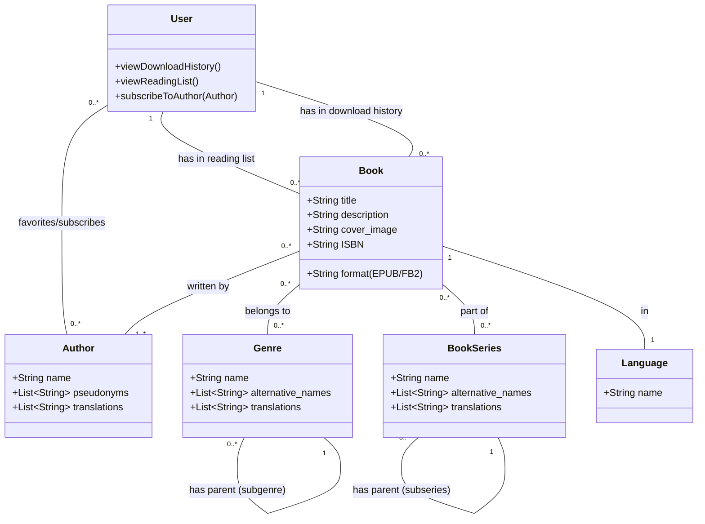

# Project: Bookshelf

## Project Overview

Bookshelf is a Django-based web application designed to be an online library for storing, cataloging, and providing access to electronic books in EPUB and FB2 formats. The application supports rich metadata, advanced search and filtering, and synchronization with the Flibusta library database.

### Core Features
- **Book Management:** Comprehensive support for EPUB and FB2 formats with integrated in-browser reading.
- **Metadata & Search:** Detailed storage of titles, authors, descriptions, genres, and series with advanced filtering.
- **Synchronization:** Automated mirroring and daily synchronization with Flibusta for selected genres and languages.
- **Personalized User Experience:** 
  - Personal download history and reading lists.
  - Favorite authors and subscription system for new book notifications.
- **OPDS Interface:** Integration with external e-readers and applications.
- **Authentication:** Secure access via `django-allauth`, with content and personal features restricted to authenticated users.

### Tech Stack
- **Backend:** Python 3.12+, Django 6+, Django REST Framework (DRF)
- **Database:** PostgreSQL
- **Virtualization:** Docker (planned)
- **Task Queue:** Celery with Redis as a broker
- **Frontend:** Bootstrap, HTMX (optional Vue.js/React for later stages)
- **Web Server:** Nginx

## Building and Running

1.  **Install dependencies:**
    ```bash
    pip install -r requirements.txt
    ```

2.  **Run database migrations:**
    ```bash
    python manage.py makemigrations
    python manage.py migrate
    ```

3.  **Run tests:**
    ```bash
    python manage.py test # All tests
    python manage.py test library # Specific app
    ```

4.  **Start the development server:**
    ```bash
    python manage.py runserver
    ```
    The application will be available at `http://127.0.0.1:8000`.

*Note: Docker setup is planned but not yet implemented. Use a local Python environment for now.*

## Engineering Standards

### Code Style & Conventions
- **PEP 8:** Strict adherence to PEP 8.
- **Type Hints:** Required for all function parameters and return values (Python 3.12+ features).
- **Naming:** 
  - `PascalCase` for classes.
  - `snake_case` for functions, methods, and variables.
  - `UPPER_SNAKE_CASE` for constants.
  - `_leading_underscore` for private methods.
- **Imports:** Standard library > Third-party (Django, DRF) > Local apps. Organized alphabetically. No wildcard imports.

### Django & Architecture
- **Service Layer:** Keep views thin; encapsulate business logic in dedicated service modules.
- **ORM Efficiency:** Avoid N+1 queries using `select_related` and `prefetch_related`.
- **Validation:** Always call `full_clean()` before saving models with custom validation. Use Django's `ValidationError`.
- **Authentication:** Use built-in system via `django-allauth`.

### Testing Standards
- **Framework:** `unittest` and `parameterized` libraries.
- **Structure:** Separate class for each function being tested. Mirror the code structure.
- **Verification:** Every new feature or bug fix MUST include automated tests (integration and unit).
- **Mocking:** Mock external services (Celery, Redis, OPDS servers) in unit tests.

## UML Class Diagram


